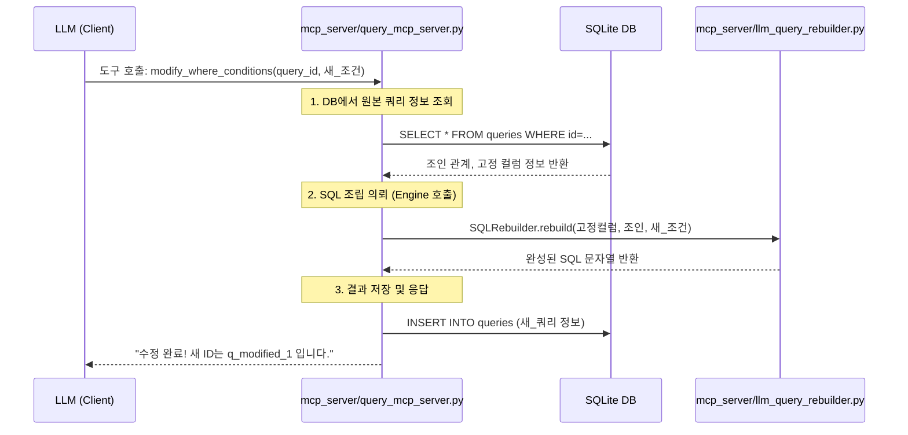

# 🏗️ Query-Bong 아키텍처 및 역할 분담

사용자님의 질문에 대해, **query_mcp_server.py**와 **llm_query_rebuilder.py**가 각각 어떤 역할을 하며 어떻게 협력하는지 정리해 드립니다.

## 1. 역할의 핵심 분리 (Interface vs Engine)

이 시스템은 **"대화 창구(Interface)"**와 **"제조 공장(Engine)"**을 철저히 분리하고 있습니다.

| 구분 | 파일명 | 역할 (Metaphor) | 주요 임무 |
| :--- | :--- | :--- | :--- |
| **Interface** | `query_mcp_server.py` | **영업 창구 (The Desk)** | LLM의 요청을 받고, DB에서 데이터를 읽어오며, 결과물을 사용자(LLM)에게 전달합니다. |
| **Engine** | `llm_query_rebuilder.py` | **기술 설계실 (The Factory)** | 전달받은 조각(SELECT, JOIN, WHERE)들을 문법에 맞는 완벽한 SQL 문장으로 조립합니다. |

## 2. LLM의 쿼리 수정 흐름 (Step-by-Step)

LLM이 직접 `llm_query_rebuilder.py` 파일을 건드리는 것이 아니라, 다음과 같은 "위임" 과정을 거칩니다.

## 3. 왜 이렇게 나누었나요? (Why this structure?)

사용자님께서 생각하신 대로 `query_mcp_server.py` 안에서 모든 것을 처리할 수도 있지만, 나누었을 때의 장점은 다음과 같습니다.

1.  **복잡도 분리**: `query_mcp_server.py`는 MCP 프로토콜 통신과 DB 처리에 집중합니다. SQL 문법을 맞추는 복잡한 로직(콤마 찍기, 따옴표 처리 등)은 `llm_query_rebuilder.py` 한 곳에서 관리하므로 유지보수가 쉽습니다.
2.  **재사용 가능성**: 나중에 MCP 서버가 아닌 일반 웹 서버나 CLI 도구를 만들더라도, SQL을 조립하는 핵심 엔진인 `llm_query_rebuilder.py`는 그대로 가져다 쓸 수 있습니다.
3.  **안전성**: LLM은 `mcp_server`가 허용한 "도구"만 사용할 수 있습니다. `llm_query_rebuilder`가 내부적으로 `JOIN`이나 `SELECT`를 고정하고 있으므로, LLM이 실수로 데이터를 다 날려버리는 위험한 쿼리를 만들지 못하도록 강력하게 방어하는 역할을 합니다.

---
> [!IMPORTANT]
> **결론적으로**: LLM은 `query_mcp_server.py`가 제공하는 **도구(Interface)**를 사용하고, 그 도구 내부에서 실제 쿼리 조립 작업은 `llm_query_rebuilder.py`라는 **전문 도구(Engine)**에게 시키는 구조입니다.
