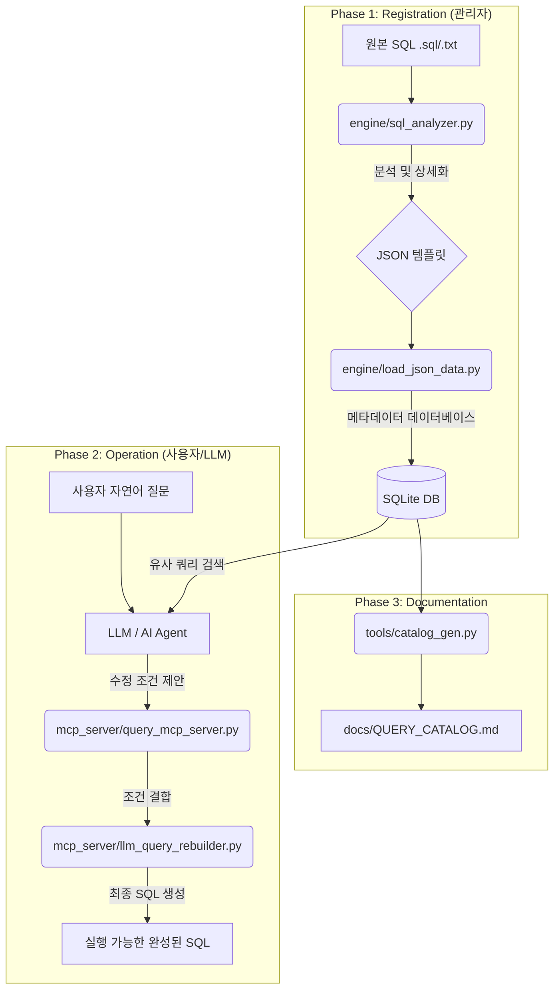

# 🔄 Query-Bong 시스템 흐름도

Query-Bong은 원본 SQL 템플릿을 분석하여 안전하게 관리하고, LLM이 필요에 따라 조건만 수정하여 실행할 수 있도록 지원하는 전체 파이프라인을 제공합니다.

## 1. 전체 데이터 흐름 (End-to-End)

## 2. 주요 단계별 설명

### 🟢 등록 단계 (Registration)
1.  **SQL 분석**: 관리자가 작성한 원본 SQL을 `sql_analyzer.py`가 읽어 SELECT 컬럼, JOIN 관계, WHERE 조건을 분리합니다.
2.  **Unit 분류**: 쿼리의 복잡도에 따라 `unitA`(단순), `unitB`(상세), `unitC`(복합)로 자동 분류합니다.
3.  **DB 인덱싱**: 분석된 정보를 SQLite 데이터베이스에 체계적으로 저장하여 나중에 LLM이 검색하기 쉬운 형태로 만듭니다.

### 🔵 운영 단계 (Operation)
1.  **추출 및 매칭**: LLM이 사용자의 질문에 가장 적합한 쿼리 템플릿을 DB에서 찾습니다.
2.  **스마트 수정**: LLM은 쿼리 전체를 새로 쓰는 대신, 미리 정의된 **수정 가능한 파라미터(WHERE 조건)**만 변경합니다.
3.  **SQL 재구축**: `mcp_server/llm_query_rebuilder.py`가 고정된 JOIN/SELECT와 수정된 WHERE 조건을 결합하여 문법적으로 완벽한 최종 SQL을 생성합니다.

### 🔴 문서화 단계 (Documentation)
1.  **자동 카탈로그**: 시스템에 등록된 모든 쿼리는 사람이 읽을 수 있는 마크다운 형태의 카탈로그로 자동 관리됩니다.

---
> [!TIP]
> 이 구조의 핵심은 **"JOIN과 SELECT는 사람이 검증한 것을 그대로 쓰고, WHERE 조건만 AI가 바꾼다"**는 점입니다. 이를 통해 SQL 생성의 안정성을 극대화합니다.
